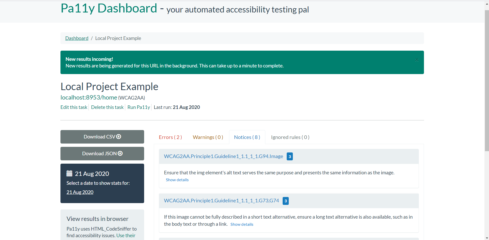
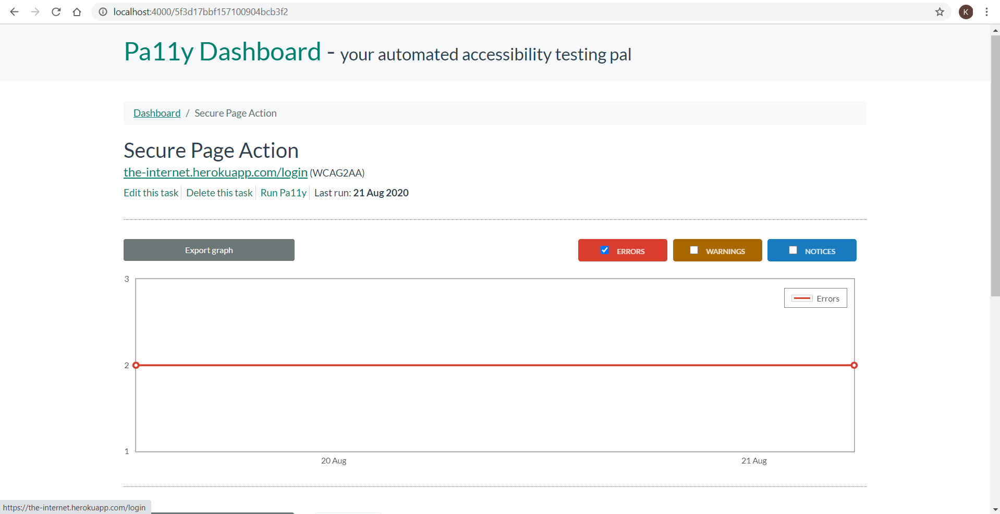
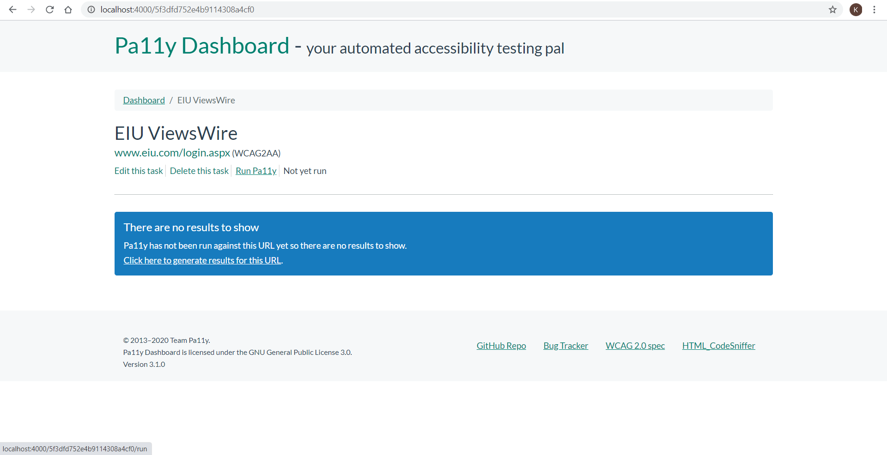

# Automated Accessibility Testing Using Pa11ly

This project is bootstrapped from Pa11ly Dashboard and can be used for Accesibility using Pa11ly.

---

## Requirements

- Node.js LTS version
- MongoDB (Usually 4+, To Store the results for the tests performed)


## Setup

In order to run this Dashboard, clone this repository locally:

```sh
git clone https://github.com/kaustubheiu/pa11ly-poc.git
```

Then installing the dependencies:

```sh
cd pa11y-poc
npm install
or
yarn install
```
## For Running the Application
```sh
    node index.js
```

### For Custom Port
```sh
    PORT=8953 node index.js // Linux & Mac
    set PORT=8953 && node index.js // Windows
```

### For installing MongoDB
- On Mac - 
```
    brew install mongodb
```
- On Windows follow official tutorial for installing MongoDb executable.
 https://docs.mongodb.com/manual/tutorial/install-mongodb-on-windows/


### Progress
Done a POC for Pa11ly Dashboard, below are some key Findings :
- Can test Public Website without Authentication and Pa11ly can generate the reports for the accessibility in CSV or JSON formats.
- With the Use of Actions in Pa11ly, we can simulate multiple behaviors across the test page. For instance : Filling up login Information and submitting form in order to navigate to Post-Auth Pages.
- Can be used to test web application running on Local Web Server.

### Local App Test


### Secure Page Task, Action



### What we couldn't figure out:
- How to simulate our testing workflow in the application for authenticated pages after login action through Pa11ly. 
Similar Issue has been opened on Pa11ly Official Github Repo : https://github.com/pa11y/pa11y/issues/456

### EIU Viewswire Task, Login



### What solution we gave a thought (A High Level Implementation):
- Breaking the above use case into atomic pieces namely - opening and accessing pages into Headless Browser with the help of puppeteer or similar tool.
- Access and fetch the compiled HTML for the specified Page using tool like HTML Sniffer.
- And, Conclusively running accessibility test on to the Resultant HTML.
- All of the above workflow is to be wired with the help of some Automation Testing Framework.
